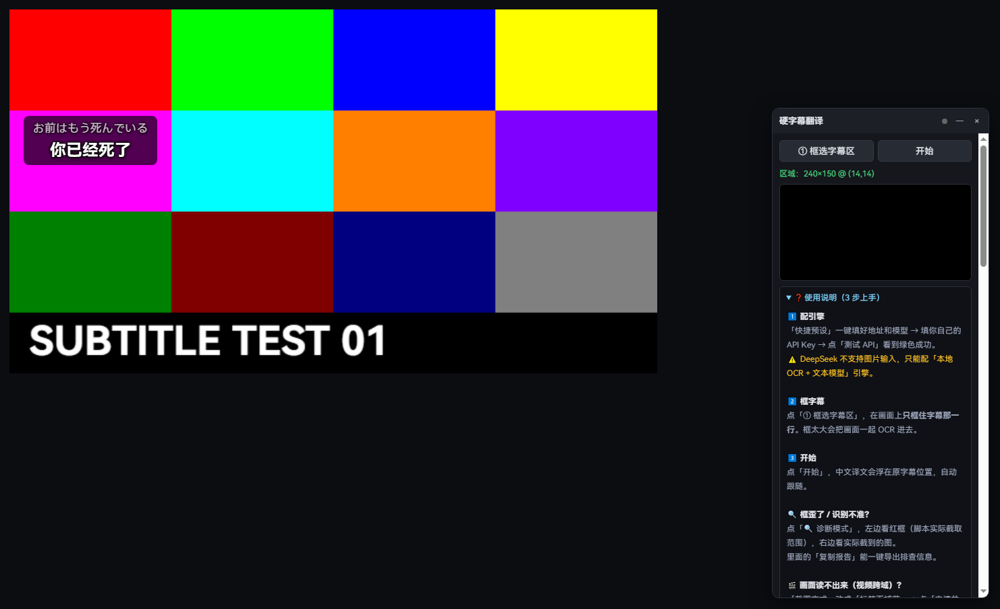
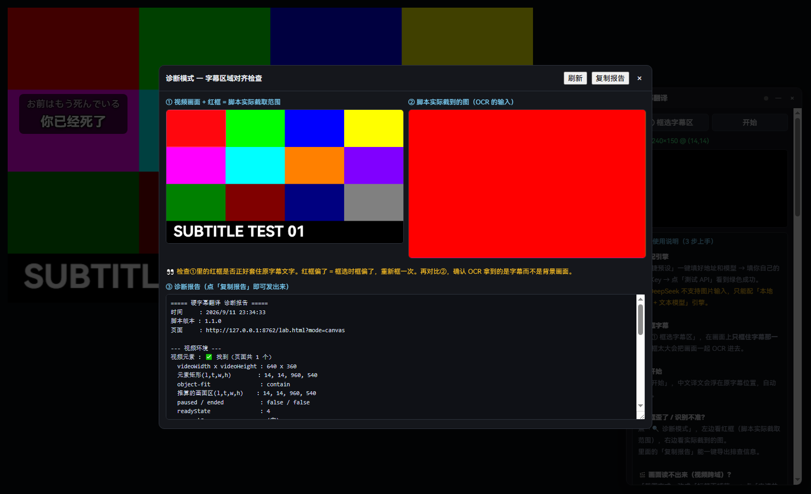
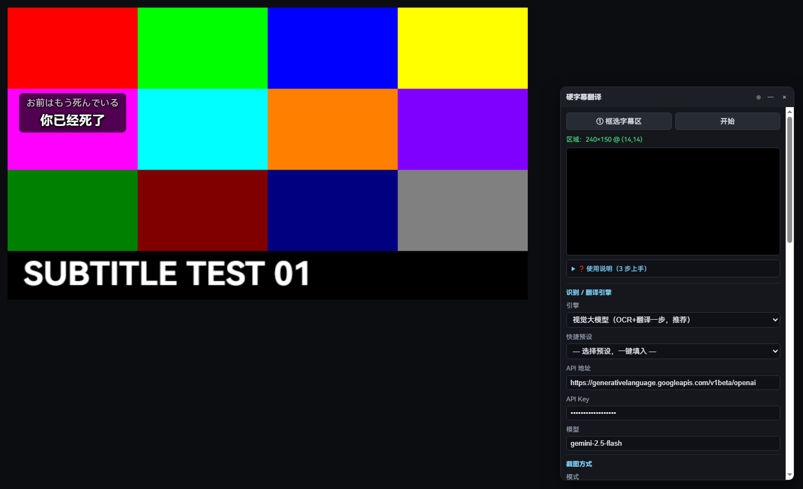
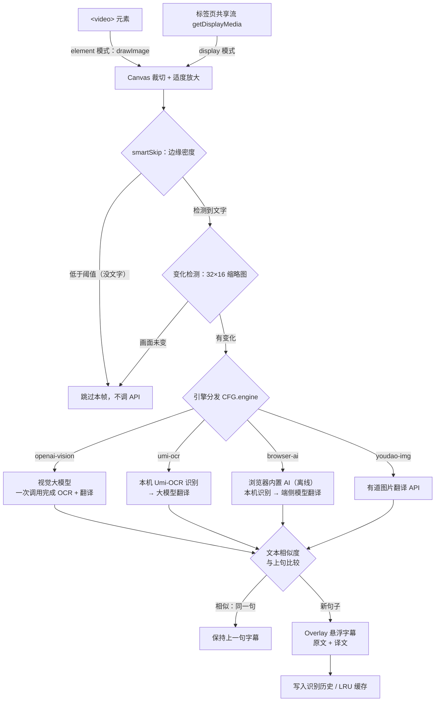
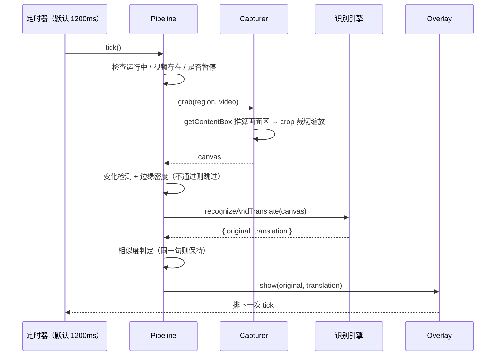

# 网页视频硬字幕实时翻译

> 给任意网站上的 `<video>` 做「硬字幕」实时翻译：**框选字幕区 → 定时截图 → OCR / 多模态大模型 → 悬浮中文字幕**。
> 不依赖任何后端服务，一个用户脚本文件即装即用；五种引擎里有四种无需浏览器下载模型（唯一会下载模型的「浏览器内置 AI」引擎，下载的是 Chrome 自带的端侧模型）。

[](https://greasyfork.org/zh-CN/scripts/595525)


---

## 目录

- [项目概述](#项目概述)
- [效果预览](#效果预览)
- [核心功能](#核心功能)
- [工作原理](#工作原理)
- [五种识别引擎](#五种识别引擎)
- [技术栈选型](#技术栈选型)
- [环境配置步骤](#环境配置步骤)
- [安装指南](#安装指南)
- [使用说明](#使用说明)
- [配置项参考](#配置项参考)
- [接口文档](#接口文档)
- [目录结构说明](#目录结构说明)
- [测试与性能基准](#测试与性能基准)
- [常见问题](#常见问题)
- [贡献指南](#贡献指南)
- [许可证](#许可证)
- [联系方式](#联系方式)
- [免责声明](#免责声明)

---

## 项目概述

### 这是什么

一个运行在浏览器里的**用户脚本（UserScript）**。它能在任何有 `<video>` 的网页上，把**已经烧进画面里的字幕**（硬字幕／hardsub）实时识别并翻译成中文，然后以悬浮字幕的形式盖在视频上方。

「硬字幕」指的是**已经渲染进视频画面像素里的字幕**——它没有独立的字幕轨，关不掉、也读不出来，只能靠 OCR 从画面上"看"。

### 解决什么问题

| 场景 | 现有方案的痛点 | 本脚本的做法 |
| --- | --- | --- |
| 生肉动画 / 日剧 / 韩剧 | 没有中文字幕轨，看不懂 | 视觉大模型一步完成「看图 → 认字 → 翻译」 |
| 外语公开课、技术演讲录像 | 字幕烧死在画面里，无法复制 | 框选字幕带，实时悬浮显示译文 |
| 视频字幕轨是外语 | 平台不提供中文轨 | 同样适用（把字幕区框在字幕轨渲染的位置即可） |
| 想批量翻译 | 传统方案要下载 ffmpeg、抽帧、跑本地 OCR | 浏览器内截图 + 云端 API，**零模型下载** |
| 不想把画面发给云服务 / 没有 API Key | 云端方案必须联网、要密钥、按量计费 | 引擎切到「浏览器内置 AI」，识别与翻译全在本机完成，**不联网、不花钱** |

### 它不是什么

- **不是字幕轨翻译器。** 如果你的视频本来就有可关闭的字幕轨（YouTube、B 站这类），请直接用专门读字幕轨的工具——体验更好、更准、更省钱。本脚本是给「字幕就画在画面上」的视频用的。
- **不是视频下载器 / 去水印工具。**
- **不内置任何 OCR 模型或翻译服务。** 识别与翻译能力来自你自己配置的后端（视觉大模型 / 本机 Umi-OCR / 浏览器内置 AI / 有道智云），费用与配额由对应平台结算（浏览器内置 AI 免费）。

### 设计目标

1. **通用**——`@match *://*/*`，任何网站都能用，不绑定特定站点。
2. **不打扰**——页面上没有视频时只留一个右下角小胶囊；iframe 里没视频就完全不挂载；被禁用的站点彻底不介入。
3. **省钱**——多重跳过机制（画面变化检测 + 边缘密度 + 文本相似度 + LRU 翻译缓存）把无效 API 调用压到最低。
4. **零依赖**——产物是单文件原生 JS，运行时零依赖、即装即用；源码按功能组件分放在 `src/` 下，构建只做**零依赖的纯文本拼接**（只用 Node 内置模块，`npm install` 都不需要），检测试套件同样如此。

---

## 效果预览

> 以下截图由 `_test/shots.mjs` 在无头 Chrome 中自动生成，可在本地复现。

### 控制面板与悬浮字幕



右侧为控制面板（可拖动、可调宽、位置会记住），画面下方为悬浮字幕层——**原文 + 译文**同屏显示，样式可调。

### 诊断模式



一键生成纯文本**诊断报告**：视频元素几何、`object-fit` 推算的画面区、当前截图后端、框选区域与视频像素坐标的换算、识别历史与错误详情。排查"框不准/识别不出来"时直接复制粘贴即可。

### 完整布局



面板支持拖拽调宽（260–760px），收起使用说明后即是完整设置界面。

---

## 核心功能

### 识别与翻译

- **五种识别引擎**，面板内一键切换（详见[五种识别引擎](#五种识别引擎)）：
  - `openai-vision`（默认）——OpenAI 兼容的**视觉大模型**，一次 API 调用同时完成 OCR + 翻译。
  - `umi-ocr`——调用**本机运行的 Umi-OCR**（PaddleOCR 引擎，离线免费、识别率最高），再交给大模型翻译。
  - `browser-ai`——**浏览器内置模型翻译**（Chrome 138+ / Edge）：识别可用 Umi-OCR 或端侧多模态读图，翻译走内置翻译模型。不要 API Key、不产生费用；Chrome 上是端侧模型（不联网），Edge 上 `ja→中文` 需开启「经英语中转」。
  - `web-translate`——**免费网页接口翻译**：本机 Umi-OCR 识别 + 逆向复用翻译网站自己的前端接口（腾讯 / 彩云 / 必应），不要 API Key、不花钱。⚠️ 属非公开接口，见下文性质说明。
  - `youdao-img`——**有道智云图片翻译** API，OCR + 翻译一步到位。
- **多平台预设**：Gemini、阿里云百炼（Qwen-VL）、智谱 GLM-4V、月之暗面 Kimi、OpenAI、OpenRouter、DeepSeek——选中即自动填入地址与模型。
- **模型能力校验**：自动识别"不支持图片输入"的模型（如 `deepseek-v4-pro`、`gpt-3.5-turbo`）并提示，必要时自动切换到 Umi-OCR 引擎，避免配好了却一直报错。
- **思考模式自动处理**：对 DeepSeek 接口自动发送 `{"thinking":{"type":"disabled"}}`——思维链对字幕 OCR 毫无必要，还会吃掉输出预算导致正文为空。
- **配置档案（Profiles）**：保存多套 API 配置，一键切换供应商，不用反复重打 Key。

### 截图

- **两种截图来源，自动切换**：
  - `element` 模式——直接读取 `<video>` 元素像素。最快、无需授权。
  - `display` 模式——`getDisplayMedia` 捕获当前标签页。一定能拿到像素（跨域视频也适用），首次需手动授权。
  - `auto` 模式——优先 `element`；一旦检测到画布被跨域污染，自动请求切换到 `display`。
- **智能跳过（省钱核心）**：
  - 32×16 灰度缩略图**变化检测**——画面没变就跳过（默认阈值 `0.004`）。判据记的是「上一次**花钱识别过**的那一帧」，因此「画面静止但认不出文字」时同一张图只买一次。
  - 160×48 **边缘密度**判定——区域里没有文字就跳过（默认阈值 `0.035`）。
  - 文本**相似度**去重——和上一句是同一句就保持（默认阈值 `0.28`）。
  - **LRU 翻译缓存**（上限 500 条）——重复台词直接命中，不再付费重翻。
  - **切到后台标签页自动暂停**——视频在后台会继续播放，不暂停就会一直花钱而没人看得到结果（`pauseWhenHidden`，默认开）。
  - **出错按类型退避**——429 指数退避（封顶 60s），5xx/超时封顶 15s；Key / 地址 / 模型名写错这类配置问题**不退避而是直接停止**并提示去改（重试永远不会好）。

### 显示与交互

- 悬浮字幕层：原文/译文同屏、字号、颜色、背景不透明度、描边、上下位置、垂直微调全部可调。
- **全屏适配**：浏览器全屏时只渲染全屏元素子树，脚本会把 UI 自动搬进全屏容器；若全屏的就是 `<video>` 元素本身（替换元素不渲染子节点），则自动改用**原生字幕轨**输出。
- **SPA 兼容**：`MutationObserver` 监听视频出现；路由变化（对比 `pathname + search`）后自动重新校验区域。
- **按站点记忆**：框选区域按 hostname 分别存储，换站不串台。
- **本站禁用**：一键把当前站点加入黑名单（可用油猴菜单或面板按钮，随时恢复）。
- **iframe 感知**：只在真正含视频的 frame 内挂载，广告/统计框架不受影响。

### 工程与可维护性

- **536 项端到端测试**，覆盖引擎协议、UI 行为、全站运行策略、布局几何、全屏搬移、性能基准。
- **A/B 性能基准**工具：新旧两版交替跑、取中位数，输出逐项差异。
- **零第三方依赖**：测试框架基于 Node 内置 WebSocket 直接驱动 Chrome DevTools Protocol。

---

## 工作原理



### 一次截图循环的时序



### 关键设计取舍

| 问题 | 方案 | 原因 |
| --- | --- | --- |
| 跨域视频读不到像素 | 检测画布污染 → 自动切 `getDisplayMedia` 标签页捕获 | 标签页捕获绕过 CORS 限制，代价是首次要用户点一次授权 |
| 全屏时 UI 消失 | 把 UI 搬进 `document.fullscreenElement` | 浏览器全屏只渲染全屏子树 |
| 全屏元素是 `<video>` 本身 | 改用原生 `TextTrack` 输出 | `<video>` 是替换元素，子节点不会被渲染 |
| 截图缩放尺寸 | 高度不足 200px 时放大，封顶 3× 且宽 ≤1400 | 字幕只有几十像素高时 OCR 认不出；放太大只是白烧 token |
| 页面用 Trusted Types | 所有 `innerHTML` 走 `setHTML()` 封装 | YouTube 等站点启用 Trusted Types 后直接赋值会抛异常 |
| 思维链吃掉输出预算 | DeepSeek 自动禁用思考模式 | 正文变空会被误判成"识别不出来" |

---

## 五种识别引擎

| | `openai-vision`（默认） | `umi-ocr` | `browser-ai` | `web-translate` | `youdao-img` |
| --- | --- | --- | --- | --- | --- |
| **原理** | 截图直接发给视觉大模型，一步完成 OCR + 翻译 | 本机 Umi-OCR（PaddleOCR）识别 → 文本交大模型翻译 | 本机识别（Umi-OCR 或端侧多模态读图）→ 浏览器内置模型翻译 | 本机 Umi-OCR 识别 → 逆向免费网页接口翻译 | 有道智云图片翻译 API |
| **API 调用次数** | 1 次 | 2 次（本地 OCR 不计费 + 1 次翻译） | 0 次（全在本机） | 2 次（本地 OCR + 1 次免费接口） | 1 次 |
| **费用** | 按 token 计费 | 仅翻译的 token 费用 | **完全免费** | **完全免费** | 按量计费（非免费额度） |
| **联网** | 需要 | 需要（调用大模型时） | **Chrome 上不需要**；Edge 是同名 API 的另一套实现，是否完全本地未经证实 | 需要 | 需要 |
| **稳定性** | 取决于供应商 | 取决于供应商 | 取决于浏览器版本 | ⚠️ **随时可能失效**（非公开接口） | 取决于供应商 |
| **需要** | 支持图片输入的模型 + API Key | 本机 Umi-OCR | Chrome 138+ / Edge 148+、HTTPS 或 localhost、**首次下载一次语言包** | 本机 Umi-OCR | 有道 appKey / appSecret |
| **适用** | 默认首选，配置最简单 | 追求最高识别率 | 想完全离线、不想填 Key | 不想填 Key 又愿意接受接口可能失效 | 已有有道账号 |

> **注意**：`openai-vision` 必须选**支持图片输入**的模型。DeepSeek 侧统一用 `deepseek-flash`（支持图片）。选到纯文本模型时，面板会自动切换到 `umi-ocr` 引擎。

### 关于 `browser-ai`（浏览器内置模型）

直接用浏览器**自带**的模型完成翻译，不需要任何 API Key，也不产生任何费用：

| 环节 | 两条路线（面板「识别方式」里选） |
| --- | --- |
| **识别** | `umi`：本机 Umi-OCR（推荐，识别率最高）<br>`builtin`：端侧多模态模型直接读图（零安装，识别率一般；**只有 Chrome 有**） |
| **翻译** | `Translator`（端侧翻译模型，快、专为翻译训练）<br>语言对不可用时：经英语中转，或退回 `LanguageModel`（端侧大模型）文本翻译 |

> ⚠️ **Chrome 和 Edge 不是同一套实现**，别把两者当成一回事：

| | Chrome 138+ | Edge 145（实测） |
| --- | --- | --- |
| 模型位置 | 端侧模型（语言包下载到本机） | 同名 API，但是另一套实现；**是否完全本地未经证实**，不要把它当作隐私保证 |
| `LanguageModel`（多模态大模型） | ✅ 有 | ❌ **没有** —— 「浏览器内置多读图」用不了，语言对一旦不支持也没有大模型可退 |
| `Translator` 日语 → 中文 | 可用 | ❌ **必报** `UnknownError: Other generic failures occurred.`（`zh`/`zh-Hans`/`zh-Hant`/`zh-CN`/`zh-TW` 全试过，全挂） |
| `Translator` 其他语言对 | 可用 | ✅ ja→en、ja→ko、ja→fr、en→zh 都正常 |

**Edge 用户怎么办？** 勾上面板的「语言对不可用时经英语中转」即可：脚本会改走 `日语 → 英语 → 中文` —— 这两条腿在 Edge 上都是好的。代价是过两道翻译，语气和专有名词会比直连差一些（实测 `お腹の奥` 会变成「胃」、`Gスポット` 会变成「是个地方」），所以它**只在直连确认失败后才启用**（默认开启，可在面板关掉；关掉后会给出可操作的报错而不是静默失败）。想要直连质量就换 Chrome。

> **纯拟声字幕会被模型「刷屏」** —— 这是端侧模型的通病，脚本已做压制：遇到「ああっああっああっ」这种输入，模型会失控地重复同一个片段（实测一句 18 字原文 → 971 字的 `Oh, oh, oh…` → 再过一遍变成 3613 字、耗时 5.6 秒）。现在 `baiCollapseRepeat()` 会把「同一短片段连续重复 5 次以上」压成两遍，正常句子一个字都不动，最终显示成「哦,哦」这样干净的短句。

四条实测得出的硬约束（Chrome 153 / Edge 145）：

1. **首次必须点一次「准备离线模型」**——模型下载只在**用户点击**的调用栈里被允许，主循环不会自己偷偷下载。
2. **端侧模型声明支持的语言里没有中文**，所以要求它输出中文时不能写 `expectedOutputs`，只能靠提示词引导；多模态读图按**源语言**声明（日语可用，中文源语言请改用 Umi-OCR）。
3. **跨域 iframe 默认用不了**这两个 API（Permissions Policy），而本脚本又常挂在播放器的 iframe 里——面板上的「检测浏览器 AI」会明确告诉你当前页行不行。
4. **光看 `availability()` 判断不出语言对能不能用**：Edge 对 ja→中文会老实回 `downloadable`、`create()` 也成功，只有真去 `translate()` 才炸。所以「准备离线模型」会**真跑一句自检**，在用户手势还在的时候就把坏语言对试出来 —— 否则你会一直播到第一句字幕才发现。

### 关于 `web-translate`（免费网页接口）

**先说清楚性质，别用错了地方**（面板上也是这段）：

- 这些是各家的**内部接口，不是公开 API**。服务条款上通常**不允许第三方直接调用**。
- 随时可能改版、限流、封 IP。适合**个人自用、学习、小批量**；不要刷量，也不要用它做面向公众的服务。
- 要稳定，请走官方 API（`openai-vision` / `youdao-img`）或本地模型（`browser-ai` / 本机大模型）。

它只做**文本翻译**，识别仍由本机 Umi-OCR 负责 —— 所以引擎是「本机识别 + 免费在线翻译」的组合，**必须先装好 Umi-OCR 并开着 HTTP 服务**。

| 接口 | 端点 | 特点 |
| --- | --- | --- |
| 腾讯交互翻译 | `transmart.qq.com/api/imt` | 纯 JSON、**无需任何鉴权**，最省事（降级链首位） |
| 彩云小译 | `api.interpreter.caiyunai.com/v1/translator` | 用它前端里硬编码的公开 token；不接受 `auto` 源语言 |
| 必应翻译 | `cn.bing.com/ttranslatev3` | 要抓页面里的 IG + token；token 会过期，脚本会自动重取 |

实现里的几处关键处理：

1. **语言码逐家映射**（`wtLangPair`）：同一门语言三家叫法不一样 —— 必应要 `auto-detect` / `zh-Hans`，彩云要 `ja2zh` 且不接受 `auto`，腾讯繁体用 `zh-TW`。不支持的组合直接跳过该引擎。
2. **降级链**：默认「腾讯 → 彩云 → 必应」，前一个失败自动换下一个；三家全挂时错误里带上**每一家的原因**，不会只说一句"翻译失败"。面板上也可以锁定只用一个。
3. **限速**（`wtMinInterval`，默认 1200ms）：同一引擎两次请求之间强制隔开，别把人家接口打挂 —— 也就不容易吃到限流。
4. **必应 token 过期重取**：返回空 body 就是 token 失效，丢掉上下文重抓一次再翻。（实测 `www.bing.com` 会回 200 + **空 body**，所以固定用 `cn.bing.com`。）
5. **「测试各接口」按钮**：三个接口各试一次并列出耗时与结果，不用靠猜谁还活着；每个引擎的成功/失败次数与最近错误也会进诊断报告。

### 引擎请求体示例

**openai-vision**（OpenAI 兼容 `/chat/completions`，图片必须放在 `user` 消息里）：

```jsonc
{
  "model": "deepseek-flash",
  "max_tokens": 1024,
  "thinking": { "type": "disabled" },   // 仅当 thinkingMode 判定需要时附加
  "messages": [
    { "role": "system", "content": "你是一个视频硬字幕识别与翻译引擎。…只输出一个 JSON 对象…" },
    { "role": "user", "content": [
        { "type": "text", "text": "请识别并翻译这张字幕图片。" },
        { "type": "image_url", "image_url": { "url": "data:image/jpeg;base64,…" } }
    ]}
  ]
}
```

**umi-ocr**：

```jsonc
// POST http://127.0.0.1:1224/api/ocr
{
  "base64": "…",                                  // 不带 data:image/...;base64, 前缀
  "options": {
    "ocr.language": "models/config_japan.txt",
    "tbpu.parser": "single_none",                 // 字幕是单行，禁止自动断行
    "data.format": "text"
  }
}
// 响应：{ "code": 100, "data": "おはようございます" }   code=100 成功，101 无文字
```

**youdao-img**（表单编码，非 JSON）：

```
POST https://openapi.youdao.com/ocrtransapi
type=1&q=<base64>&from=auto&to=zh-CHS&appKey=…&salt=…&sign=…&signType=v3&curtime=…&docType=json&render=0&translateOption=1

# sign = sha256(appKey + truncate(q) + salt + curtime + appSecret)
# 计算签名时 q 不做 URL encode，编码只发生在发送前
```

---

## 技术栈选型

### 为什么是原生 JS，而不是 React/Vue + 打包工具

| 维度 | 原生 JS + 零依赖拼接（本项目） | 框架 + 打包 |
| --- | --- | --- |
| **安装体验** | 单个 `.user.js` 文件，Tampermonkey 里点一下就完事 | 需要构建产物、多文件加载、有时还要 CDN |
| **页面隔离** | 完全注入页面上下文，无沙箱冲突 | 框架运行时可能与页面自身冲突 |
| **体积** | ~217KB（含全部注释与 UI） | 运行时 + 组件库通常 ≥300KB |
| **可审计性** | 用户能直接读懂每一行：构建只是把 `src/` 的模块按顺序连起来，不重命名、不转译、不压缩 | 压缩混淆后难以审计 |
| **维护成本** | 无第三方依赖、无供应链风险；源码可按功能组件分文件维护 | 需要持续跟进依赖安全更新 |

用户脚本的核心价值是**可读、可审计、即装即用**。本项目因此只保留一条零依赖的拼接构建
（`npm run build`，见 [`docs/ARCHITECTURE.md`](docs/ARCHITECTURE.md#源码结构与构建)）：
它不是"构建链"，而是把分文件的源码还原成必须单文件的产物 —— 装到 Tampermonkey 里
依然只是一个文件，用户侧的一切承诺不变。

### 选型明细

| 需求 | 选型 | 理由 |
| --- | --- | --- |
| 跨域 HTTP 请求 | `GM_xmlhttpRequest` | 用户脚本特权 API，绕过页面 CORS 限制；无需自建代理后端 |
| 配置持久化 | `GM_setValue` / `GM_getValue` | 天然跨站点共享、跨会话保留 |
| 截图（同源） | `Canvas.drawImage(video)` | 零授权、零延迟，直接读视频元素像素 |
| 截图（跨域） | `getDisplayMedia` 标签页捕获 | 唯一能绕过画布污染的手段 |
| 图片编码 | `canvas.toDataURL('image/jpeg', q)` | 同步、简单、与视觉 API 的 data-URL 输入天然契合 |
| 变化检测 | 32×16 灰度缩略图 + 平均绝对差 | 比逐像素比对快三个数量级，足以判断"画面是否变化" |
| 文字存在性判定 | 160×48 边缘密度（Sobel 简化版） | 文字＝高对比边缘；一次判定挡掉大量无效 API 调用 |
| 重复文本去重 | 归一化编辑距离（滚动行 DP） | 容忍 OCR 抖动（错字、标点差异），比全等比较实用 |
| 翻译缓存 | `Map` + LRU（命中后重插入） | `Map` 保持插入顺序，删除再写入即等于"移到队尾"，无需额外数据结构 |
| 动态内容监听 | `MutationObserver` | 比轮询省 CPU；配合有限次数的兜底轮询覆盖懒加载 |
| 富文本注入 | Trusted Types 安全的 `setHTML()` | 兼容启用了 Trusted Types 的站点（如 YouTube） |
| 端到端测试 | Node.js 内置 WebSocket + CDP | **零依赖**，直接驱动真实 Chrome，断言真实 DOM 与网络桩 |
| 性能基准 | A/B 交替运行取中位数 | 消除机器负载漂移，量化优化收益 |

### 明确放弃的方案

- **浏览器内置 OCR（Tesseract.js 等）**——需要下载数十 MB 模型与 WASM，首次加载慢、识别率对动画字幕偏弱，且与"零模型下载"的设计目标冲突。
- **ffmpeg.wasm 抽帧**——体积巨大（~25MB），解码开销高，而 `drawImage` 已经能直接拿到画面像素。
- **本地部署翻译模型**——用户机器性能差异过大，配置门槛高；交给用户自选的云端 API 更灵活。
- **自建后端代理**——违背"不依赖任何后端服务"的目标，也带来隐私与运维负担。

---

## 环境配置步骤

### 1. 浏览器 + 用户脚本管理器

| 浏览器 | 推荐管理器 |
| --- | --- |
| Chrome / Edge / Brave | [Tampermonkey](https://www.tampermonkey.net/) |
| Firefox | [Tampermonkey](https://www.tampermonkey.net/) 或 [Violentmonkey](https://violentmonkey.github.io/) |
| Safari | [Tampermonkey](https://www.tampermonkey.net/)（需在系统设置中允许扩展） |

### 2. 一个可用的识别 / 翻译服务

五选一（可随时在面板切换）：

**A. OpenAI 兼容的视觉大模型（推荐，最省事）**

- 注册任一受支持平台并获取 API Key：DeepSeek / Google Gemini / 阿里云百炼 / 智谱 GLM / 月之暗面 Kimi / OpenAI / OpenRouter
- 记下**接口地址**（Base URL）与**模型名**——也可以直接在面板里选预设
- 要求：模型**必须支持图片输入**（vision）

**B. 本机 Umi-OCR（识别率最高，离线免费）**

1. 从 <https://github.com/hiroi-sora/Umi-OCR/releases> 下载并安装 Umi-OCR
2. 启动后进入「全局设置」→ 勾选**高级**→ 打开 **HTTP 服务**（默认端口 `1224`）
3. 在面板选择引擎「Umi-OCR 本地识别」，点「测试连接」确认能识别出文字
4. 仍需要一个文本大模型来做翻译（Umi-OCR 只负责认字）

**C. 浏览器内置模型（不要 Key，Chrome 上完全离线）**

1. 用 **Chrome 138+ 桌面版**打开页面（Edge 也支持，但见下面的注意），且页面是 HTTPS 或 localhost
2. 面板引擎选「浏览器内置 AI」→ 点「检测浏览器 AI」确认支持情况
3. 点「准备离线模型」，等语言包下载完成并看到「自检通过」（只需一次，之后一直可用）
4. 识别方式建议配 Umi-OCR；不想装软件就选「浏览器内置多模态读图」（**只有 Chrome 有**）
5. **Edge 用户注意**：Edge 没有多模态大模型，且内置翻译对「日语 → 中文」必报 `Generic failures`。面板上默认勾着「语言对不可用时经英语中转」，会自动改走 `日语 → 英语 → 中文`；想要直连质量请改用 Chrome。

**D. 有道智云图片翻译**

1. 在 <https://ai.youdao.com/> 创建应用，获取 **appKey**（应用 ID）与 **appSecret**（应用密钥）
2. 在面板填入，选择引擎「有道图片翻译」
3. 注意：该项**按量计费**，不是免费额度

**E. 免费网页接口（不要 Key，但接口随时可能失效）**

1. 先按上面的 **B** 装好并运行 Umi-OCR（识别靠它）
2. 引擎选「免费网页接口」→ 点「测试各接口」看谁还活着
3. ⚠️ 用的是各家**内部接口**，不是公开 API，服务条款上通常不允许第三方调用；仅建议个人自用，不要刷量

### 3. 运行测试与基准（仅开发需要）

| 依赖 | 版本要求 | 说明 |
| --- | --- | --- |
| Node.js | **≥ 22**（建议 22.4+） | 测试依赖全局 `WebSocket`（Node 22.4 起转为稳定、无需 flag）；`fetch` 与顶层 `await` 也必需。本项目实测于 Node 24.14 |
| Google Chrome | 任意近期版本 | 测试通过 CDP 驱动真实 Chrome，默认路径见下 |
| npm 依赖 | **无** | 全部使用 Node 内置模块 |

Chrome 可执行文件路径默认是：

```
C:\Program Files\Google\Chrome\Application\chrome.exe
```

若你的 Chrome 装在别处，设置环境变量 `CHROME_PATH` 覆盖（见 [`docs/TESTING.md`](docs/TESTING.md)）：

```powershell
$env:CHROME_PATH = 'D:\Apps\Chrome\chrome.exe'
```

---

## 安装指南

### 方式一：从 Greasy Fork 安装（推荐）

打开 [Greasy Fork 脚本页](https://greasyfork.org/zh-CN/scripts/595525)，点「**安装此脚本**」。

- Greasy Fork 会自动检测新版本，更新由用户脚本管理器接管，不必手动重装；
- **国内可直接访问**，不需要代理；
- 脚本的讨论与评分也集中在这里。

> Greasy Fork 上的版本与 GitHub 版本内容一致（同源发布）。但两者的更新渠道相互独立——Greasy Fork 版从 Greasy Fork 更新，GitHub 版从 GitHub 更新——**任选一个安装即可，不要同时装两份**。

### 方式二：从 GitHub 直接安装

安装用户脚本管理器后，点击下面这个链接，Tampermonkey 会弹出安装页面，点「安装」即可：

```
https://raw.githubusercontent.com/1105532539/video-hardsub-translator/main/video-hardsub-translator.user.js
```

也可以手动操作：Tampermonkey 面板 → **实用工具** → 「从 URL 安装」→ 粘贴上面的地址。

> **国内网络提示**：如果 `raw.githubusercontent.com` 打不开（国内较常见），**优先改用上面的方式一（Greasy Fork）**；也可以把地址换成 jsDelivr 镜像——两者内容**完全一致**（已用 SHA-256 校验为同一文件）：
>
> ```
> https://cdn.jsdelivr.net/gh/1105532539/video-hardsub-translator@main/video-hardsub-translator.user.js
> ```
>
> 或者改用下面的 **方式三（Releases）**：附件托管在 `github.com` 上，通常同样可以下载。
>
> 注意 jsDelivr 有缓存（最长约 12 小时），刚发布的新版本可能不会立刻生效；需要最新版请用上面的原始地址或 Releases。

### 方式三：从 Releases 安装

前往本仓库的 **Releases** 页面，下载最新版的 `video-hardsub-translator.user.js`，然后：

- 直接把文件**拖进浏览器窗口**，或
- 在 Tampermonkey 面板 → **实用工具** → 「导入文件」

### 方式四：手动新建（用于二次开发）

1. Tampermonkey 面板 → 「添加新脚本」
2. 清空编辑器内容，粘贴 `video-hardsub-translator.user.js` 的全部源码
3. `Ctrl + S` 保存

### 本地开发（克隆仓库）

```bash
git clone https://github.com/1105532539/video-hardsub-translator.git
cd video-hardsub-translator

# 源码在 src/ 下，按功能组件分模块；改完重新拼出根目录的产物
npm run build              # 零依赖拼接（只用 Node 内置模块）
npm run build:check        # 只校验产物与 src/ 是否一致（提交前用）

# 运行测试（需要 Node ≥ 22 与本机 Chrome）
npm test                   # 全部 9 个套件；会自动先跑一次 npm run build
node _test/engine.mjs      # 引擎层：请求体 / 响应解析 / 错误提示
node _test/smoke-panel.mjs # 面板冒烟：挂载 / 预设 / 导入导出 / 诊断
```

> ⚠️ **不要直接编辑**根目录的 `video-hardsub-translator.user.js` —— 它是构建产物，
> 改了会被下次构建覆盖。请改 `src/` 里对应的模块（模块分工见
> [`docs/ARCHITECTURE.md`](docs/ARCHITECTURE.md#模块地图)）。

### 安装后首次配置

先选一条路线（五种引擎里只有两种不要 API Key）：

```text
想省事    → 视觉大模型：选平台预设 → 填 API Key → 点「测试 API」
要离线    → 浏览器内置 AI：点「准备离线模型」，等语言包下载完
不想填Key → 免费网页接口：需先装好本机 Umi-OCR
最省钱    → Umi-OCR 本地识别：本机认字，只花翻译那点钱
```

然后：

1. 打开任意有视频的网页，右下角会出现**小胶囊**（面板**默认收起**，不挡画面）
2. **点一下胶囊展开面板**——之后会记住这个选择，新页面直接展开；点标题栏的 × 可再收起
3. 点「**框选字幕区**」在视频上拖出字幕带
4. 点「**开始**」——译文会以悬浮字幕的形式出现在画面下方

> 配好之后建议点「**保存当前配置**」存成档案，以后在「我的配置」里一键切换，不用重打 Key。

---

## 使用说明

### 基本流程

| 步骤 | 操作 | 说明 |
| --- | --- | --- |
| 1 | 播放视频 | 脚本会自动找到页面上**面积最大**的、≥200×120 的 `<video>` |
| 2 | 点「**框选字幕区**」 | 鼠标在视频上按住拖动，框住**字幕所在的那一条带**（略高于字即可，不必贴合） |
| 3 | 点「**开始**」 | 进入截图循环，状态栏显示运行状态 |
| 4 | 观察悬浮字幕 | 译文出现在字幕区上方（可切换为下方），原文可选显示 |
| 5 | 需要时调整 | 拖动面板、调字号/颜色/位置、改截图间隔 |

> **框选要点**：框得**紧一点**（只框字幕那一带）比框大更好——区域越小，OCR 越准、边缘密度判定越可靠、API 越省钱。

### 面板功能速览

| 区域 | 功能 |
| --- | --- |
| **引擎** | 五种引擎切换、平台预设、API 地址 / Key / 模型名、思考模式、最大输出 |
| **Umi-OCR** | 服务地址、识别语言、**测试连接** |
| **浏览器内置 AI** | **检测浏览器 AI**、**准备离线模型**（带下载进度）、识别方式、翻译方式、流式显示、经英语中转 |
| **免费网页接口** | 翻译接口选择、最小请求间隔、**测试各接口** |
| **有道** | appKey / appSecret / 翻译方向 / 大模型 pro |
| **截图** | 截图方式（自动 / 直接读取 / 标签页捕获）、**申请共享**、**停止共享**、截图间隔 |
| **识别优化** | 智能跳过（无文字时不调 API）、**切到后台标签页时暂停**、相似度阈值 |
| **外观** | 字号、译文颜色、背景不透明度、描边、显示原文、译文在字幕上方/下方、垂直微调 |
| **配置档案** | 保存 / 应用 / 删除多套 API 配置 |
| **工具** | **诊断模式**、**测试 API**、**手动截一帧**、导出配置、导入配置 |
| **高级** | 恢复「本站禁用」的网站、**本站禁用**、恢复默认、清空缓存 |
| **最近识别** | 面板底部，最近 30 条「原文 → 译文」记录 |

### 状态栏提示含义

| 提示 | 含义 | 建议 |
| --- | --- | --- |
| `请先框选字幕区域` | 还没框选 | 点「框选字幕区」 |
| `画面未变化，跳过` | 缩略图判定画面没变 | 正常省流行为 |
| `未检测到文字，跳过（边缘密度 …）` | 区域里没有文字 | 正常；若**始终**如此说明区域框错了 |
| `与上句相似，保持` | 与上一句判定为同一句 | 正常去重 |
| `已翻译（…ms）` | 成功 | — |
| `本帧无字幕（…ms）` | 引擎返回空 | 正常（这一帧确实没字幕） |
| `只认出原文、没拿到译文，保持上一句` | 只出原文 | 常见于思考模式未关闭 |
| `截不到画面 —— 区域可能已不在视频上，请重新框选` | 区域脱离视频 | 重新框选 |
| `没找到视频元素（换集 / 换页后常见）` | 视频暂时消失 | 等待或刷新 |
| `视频已暂停` | 视频暂停 | 恢复播放 |
| `共享授权失败` | 用户取消了标签页共享 | 重新点「申请共享」 |
| `已切到后台，暂停翻译（切回本标签页自动继续）` | 切到了别的标签页 | 正常省流行为（可在「节奏」里关掉） |
| `已回到前台，继续翻译…` | 切回来了 | — |
| `出错（被限流），Ns 后重试：…` | 撞上 429，正在指数退避 | 等它自己恢复；持续如此可调大截图间隔 |
| `出错（额度不足），Ns 后重试：…` | 402，账户余额不足 | 去供应商那边充值 |
| `配置有问题，已自动停止：…` | Key / 地址 / 模型名不对 | 按提示改配置后重新点「开始」（这类问题重试不会好） |

### 进阶场景

**跨域视频（画布被污染）**

脚本会检测到画布污染并提示，随后自动请求「共享此标签页」授权。选择**当前标签页**并共享后，改为从捕获流读取像素，即可正常识别。

**全屏观看**

进入全屏后，脚本会把面板与字幕层搬进全屏容器。若你全屏的是 `<video>` 元素本身，脚本会自动改用**原生字幕轨**输出（因为 `<video>` 的子节点不会被渲染，悬浮层不可见）。

**SPA / 换集 / 懒加载**

脚本用 `MutationObserver` 等待视频出现，并在路由变化（仅比较 `pathname + search`，避免站点改 hash 时误判）后重新校验区域。换集后若字幕带位置变了，重新框选一次即可（会记住新位置）。

**多站点独立配置**

框选区域按 `hostname` 分别记忆；`CFG.regionsByHost` 上限 60 条，超出按插入顺序淘汰最旧的。

---

## 配置项参考

所有配置通过 `GM_setValue` 以 `h1sub.` 为前缀持久化，在面板中修改即自动保存。

### 引擎与接口

| 键 | 类型 | 默认值 | 说明 |
| --- | --- | --- | --- |
| `engine` | `string` | `openai-vision` | 识别引擎：`openai-vision` / `umi-ocr` / `browser-ai` / `web-translate` / `youdao-img` |
| `apiBase` | `string` | `https://api.deepseek.com` | OpenAI 兼容接口地址（结尾不要带 `/`） |
| `apiKey` | `string` | `""` | API Key |
| `model` | `string` | `deepseek-flash` | 模型名（`openai-vision` 必须支持图片） |
| `thinkingMode` | `string` | `auto` | `auto` 检测到 DeepSeek 就关闭思考 / `off` 总是关闭 / `on` 不干预 |
| `maxTokens` | `number` | `1024` | 单次回复最大 token 数 |
| `apiProfiles` | `array` | `[]` | 配置档案：`[{name, apiBase, apiKey, model, thinkingMode, maxTokens}]` |

### 有道智云

| 键 | 类型 | 默认值 | 说明 |
| --- | --- | --- | --- |
| `youdaoAppKey` | `string` | `""` | 应用 ID |
| `youdaoAppSecret` | `string` | `""` | 应用密钥 |
| `youdaoFrom` | `string` | `auto` | 源语言（`auto` / `ja` / `en` / `ko` …） |
| `youdaoTo` | `string` | `zh-CHS` | 目标语言 |
| `youdaoLLM` | `boolean` | `true` | 是否使用有道翻译大模型 pro 版 |

### Umi-OCR

| 键 | 类型 | 默认值 | 说明 |
| --- | --- | --- | --- |
| `umiBase` | `string` | `http://127.0.0.1:1224` | Umi-OCR HTTP 服务地址 |
| `umiLang` | `string` | `models/config_japan.txt` | 识别语言配置文件 |
| `umiParser` | `string` | `single_none` | 排版解析器；`single_none` = 单栏无换行（适合单行字幕） |

### 浏览器内置 AI（`engine = browser-ai`）

| 键 | 类型 | 默认值 | 说明 |
| --- | --- | --- | --- |
| `baiOcr` | `string` | `umi` | 识别方式：`umi` = Umi-OCR 本机识别（推荐）/ `builtin` = 端侧多模态读图 |
| `baiTrans` | `string` | `auto` | 翻译方式：`auto` 优先端侧翻译模型、不支持则用端侧大模型 / `translator` 只用翻译模型 / `prompt` 只用端侧大模型 |
| `baiStream` | `boolean` | `true` | 边生成边出字（个别页面上觉得闪烁可关掉） |
| `baiPivot` | `boolean` | `true` | 语言对直连失败时经英语中转（**Edge 的 `日语 → 中文` 必须开这个**）。关掉后会直接报错 |

`browser-ai` 不需要 `apiBase` / `apiKey` / `model`，语言方向由下面的 `srcLang` / `tgtLang` 按语言名映射成 BCP-47 标签（日语→`ja`、简体中文→`zh`）。

### 免费网页接口（`engine = web-translate`）

| 键 | 类型 | 默认值 | 说明 |
| --- | --- | --- | --- |
| `wtEngine` | `string` | `auto` | 翻译接口：`auto` 按降级链 / `tencent` / `caiyun` / `bing` |
| `wtMinInterval` | `number` | `1200` | 同一引擎两次请求的最小间隔(ms)，范围 0–10000；调大更不容易被限流 |

同样不需要 `apiBase` / `apiKey`；识别复用上面的 Umi-OCR 配置（`umiBase` / `umiLang`）。⚠️ 用的是**非公开接口**，随时可能失效。

### 语言

| 键 | 类型 | 默认值 | 说明 |
| --- | --- | --- | --- |
| `srcLang` | `string` | `日语` | 源语言（写进提示词） |
| `tgtLang` | `string` | `简体中文` | 目标语言 |
| `extraPrompt` | `string` | `""` | 追加到系统提示词的额外要求（高级） |

### 截图与节奏

| 键 | 类型 | 默认值 | 范围 | 说明 |
| --- | --- | --- | --- | --- |
| `interval` | `number` | `1200` | 300–60000 | 截图间隔（ms） |
| `captureMode` | `string` | `auto` | — | `auto` / `element` / `display` |
| `smartSkip` | `boolean` | `true` | — | 无文字时跳过 API 调用 |
| `pauseWhenHidden` | `boolean` | `true` | — | 切到后台标签页时暂停（视频在后台仍会播放，不暂停就是白花钱） |
| `textSimThreshold` | `number` | `0.28` | 0–0.8 | 相似度阈值，越高越不容易重复翻译 |
| `region` | `object\|null` | `null` | — | 框选区域（页面坐标 `{x,y,w,h,box}`） |
| `regionHost` | `string\|null` | `null` | — | 上述区域所属站点 |
| `regionsByHost` | `object` | `{}` | — | `{ hostname: region }`，按站点分别记忆 |

### 外观

| 键 | 类型 | 默认值 | 范围 | 说明 |
| --- | --- | --- | --- | --- |
| `fontSize` | `number` | `24` | 12–48 | 译文字号（px） |
| `showOriginal` | `boolean` | `true` | — | 是否同屏显示原文 |
| `overlayTop` | `boolean` | `true` | — | 译文在字幕区上方（否则下方） |
| `bgOpacity` | `number` | `0.68` | 0–1 | 译文背景不透明度 |
| `textColor` | `string` | `#ffffff` | — | 译文颜色（校验 `#RGB`~`#RRGGBBAA`） |
| `outline` | `boolean` | `true` | — | 文字描边（亮背景上更清楚） |
| `offsetY` | `number` | `0` | −200–200 | 垂直微调（px，正数往下） |
| `panelWidth` | `number` | `320` | 260–760 | 面板宽度 |
| `panelPos` | `object\|null` | `null` | — | 面板位置 `{left,top}`，`null` = 默认右下角 |
| `panelOpen` | `boolean` | `false` | — | 打开新页面时是否直接展开面板。`false` = 只留右下角小胶囊（点开一次会记住选择） |

### 其他

| 键 | 类型 | 默认值 | 说明 |
| --- | --- | --- | --- |
| `disabledHosts` | `array` | `[]` | 不显示面板的站点列表 |
| `onboarded` | `boolean` | `false` | 是否已完成首次运行引导 |

> **配置安全性**：调用 `sanitizeCfg()` 对加载与导入的配置做类型与区间校验。这不是洁癖——`fontSize` 是唯一被直接拼接进 HTML 的配置值，未校验的导入 JSON 可以注入 HTML。同时旧版本遗留的非法引擎名（如 `local` / `openai-text`）会被修正，否则 `<select>` 会显示空白而运行时仍按视觉引擎跑。

---

## 接口文档

完整接口文档见 **[`docs/API.md`](docs/API.md)**，包含三部分：

1. **对外调用的第三方 API**——OpenAI 兼容 `/chat/completions`（含视觉输入与思考模式参数）、Umi-OCR HTTP API（`/api/ocr`、`/api/ocr/get_options`）、有道 `ocrtransapi`（含 v3 签名算法与错误码）。
2. **脚本内部 JS API**——`window.__H1SUB__` 暴露的调试/自动化接口（`findVideo()`、`getContentBox()`、`resolveRegion()`、`anchorRegion()`、`Capturer`、`Pipeline`、`Overlay`、`UI`、`Diag`、`CFG` 等），用于脚本化测试与二次开发。
3. **数据结构**——`region` 锚点结构、识别记录、诊断报告字段。

快速示例（在页面控制台执行）：

```js
const H = window.__H1SUB__;

// 找到主视频并推算其真实画面区（去掉黑边后的区域）
const v = H.findVideo();
console.log(v.videoWidth, v.videoHeight, H.getContentBox(v));

// 把字幕带设为「视频画面底部 12% 高的一条带」
const box = H.getContentBox(v);
H.CFG.region = H.anchorRegion(box.left, box.top + box.height * 0.88,
                              box.width, box.height * 0.12, v);
H.UI.syncRegion();

// 手动截一帧看看区域对不对
const canvas = H.Capturer.grab(H.CFG.region, v);
document.body.appendChild(canvas);   // 直接插到页面上目视检查

// 生成诊断报告
console.log(H.Diag.build());
```

---

## 目录结构说明

```text
video-hardsub-translator/
├── video-hardsub-translator.user.js   # ★ 构建产物（单文件，即装即用；由 src/ 拼接而来，请勿直接编辑）
├── src/                               # ★ 源码：按功能组件分模块（文件名前缀的数字就是拼接顺序）
│   ├── 00-header.js                   #   用户脚本元数据块（==UserScript==）与总说明
│   ├── 10-config.js                   #   配置：默认值、读写、规整、平台预设、模型能力判定
│   ├── 12-log.js                      #   日志
│   ├── 14-constants.js                #   热路径常量与状态栏配色
│   ├── 20-video.js                    #   视频元素定位
│   ├── 22-site.js                     #   站点级行为：禁用开关、视频出现监听、按站点记忆区域
│   ├── 24-region.js                   #   区域锚定与坐标换算
│   ├── 30-image.js                    #   截图分析与文本相似度（热路径）
│   ├── 32-util.js                     #   通用小工具
│   ├── 40-http.js                     #   GM_xmlhttpRequest 封装
│   ├── 42-youdao-sign.js              #   SHA-256、UUID 与有道错误码
│   ├── 44-umi-ocr.js                  #   Umi-OCR 本机识别
│   ├── 46-youdao-image.js             #   有道图片翻译
│   ├── 48-browser-ai.js               #   浏览器内置 AI（完全离线）：能力探测、端侧翻译、多模态读图
│   ├── 49-web-translate.js            #   免费网页接口（逆向）：降级链、限速、token 重取
│   ├── 50-capturer.js                 #   截图器（element / display 双后端）
│   ├── 60-chat.js                     #   OpenAI 兼容接口与翻译缓存
│   ├── 62-engines.js                  #   五种引擎的统一入口
│   ├── 70-pipeline.js                 #   主循环
│   ├── 80-overlay.js                  #   悬浮字幕层
│   ├── 82-fullscreen.js               #   全屏适配
│   ├── 84-html.js                     #   HTML 转义、Trusted Types、颜色
│   ├── 86-selector.js                 #   区域框选器
│   ├── 88-diag.js                     #   诊断模式
│   ├── 90-panel-html.js               #   控制面板：HTML 骨架
│   ├── 92-panel-css.js                #   控制面板：样式表
│   ├── 94-modal.js                    #   通用弹窗骨架
│   ├── 96-panel-ui.js                 #   控制面板：控件绑定、配置档案、导入导出
│   └── 98-boot.js                     #   启动装配
├── README.md                          # 项目说明（本文件）
├── LICENSE                            # GPL-3.0 许可证全文
├── CHANGELOG.md                       # 版本更新日志
├── CONTRIBUTING.md                    # 贡献指南
├── package.json                       # 声明构建 / 测试脚本入口（无第三方依赖）
├── .gitignore                         # 排除本地快照 / 调试脚本 / 测试中间产物 / 凭据
│
├── .github/
│   ├── ISSUE_TEMPLATE/
│   │   ├── bug_report.yml             # Issue 模板：缺陷报告
│   │   └── feature_request.yml        # Issue 模板：功能建议
│   └── PULL_REQUEST_TEMPLATE.md       # PR 模板
│
├── docs/
│   ├── ARCHITECTURE.md                # 架构与模块职责详解
│   ├── API.md                         # 接口文档（第三方 API + 内部 JS API）
│   ├── TESTING.md                     # 测试与性能基准指南
│   └── local-ocr-design.md            # 本地 OCR 方案设计笔记
│
├── _build/                            # 构建（零依赖：只用 Node 内置模块）
│   └── build.mjs                      #   按编号顺序拼接 src/ → 根目录产物 + 完整性校验
│
└── _test/                             # 端到端测试套件（零依赖，CDP 驱动真实 Chrome；测的是根目录产物）
    ├── cdp.mjs                        # 零依赖 CDP 封装（内置 WebSocket 驱动 Chrome）
    ├── engine.mjs                     # 引擎层：请求体 / 响应解析 / 错误提示
    ├── browser-ai.mjs                 # 浏览器内置 AI 离线引擎（内置 AI 用替身）
    ├── web-translate.mjs              # 免费网页接口（三家用 GM 桩模拟）
    ├── opt.mjs                        # 优化批次专项测试
    ├── allsite.mjs                    # 全站运行行为（该出现的才出现）
    ├── smoke-panel.mjs                # 面板冒烟 + 配置持久化
    ├── layout.mjs                     # 布局几何体检
    ├── fullscreen.mjs                 # 全屏适配
    ├── bench.mjs                      # 性能基准（热路径吞吐）
    ├── bench-ab.mjs                   # 新旧版本 A/B 对比（交替多轮取中位数）
    ├── shots.mjs                      # 生成 README 用的截图
    ├── structure.mjs                  # 方法行数统计
    ├── check-fixture.mjs              # 校验测试视频 fixture
    ├── gen-fixture.mjs                # 生成测试视频 fixture
    ├── probe.mjs                      # 环境探测
    ├── streams.json                   # HLS 公开测试流地址
    ├── fixtures/pattern.webm          # 测试视频（含已知图案，便于断言几何）
    ├── vendor/hls.min.js              # 测试页用的 HLS 播放库
    ├── pages/                         # 测试页面（lab / iframe / 空页 / 播放器）
    └── shots/                         # 截图产物（README 引用）
```

### 源码结构（`src/`）

源码按功能组件分成 29 个模块，**文件名前缀的两位数字就是拼接顺序**，后文可以依赖前文。
每个模块头部都写明了「对外提供」与「依赖」，构建脚本会逐个核对这些声明。

| 模块 | 内容 |
| --- | --- |
| `10-config` | 默认值、加载/校验/持久化、平台预设、模型能力判定 |
| `12-log` / `14-constants` | 统一前缀的 `log` / `warn`；热路径阈值与配色 |
| `20-video` / `22-site` / `24-region` | 视频查找、站点级开关与按站点记忆区域、区域锚定换算 |
| `30-image` / `32-util` | 缩略图 / 边缘密度 / 相似度；纯计算小工具 |
| `40-http` / `42-youdao-sign` | `GM_xmlhttpRequest` 封装；SHA-256 与有道错误码 |
| `44-umi-ocr` / `46-youdao-image` | Umi-OCR 本机识别；有道图片翻译 |
| `48-browser-ai` | 浏览器内置 AI（完全离线）：能力探测、端侧翻译、多模态读图、流式 |
| `49-web-translate` | 免费网页接口（逆向）：语言码映射、降级链、限速、token 重取、测活 |
| `50-capturer` | `element` / `display` 双后端、裁切缩放、污染处理 |
| `60-chat` / `62-engines` | 缓存、请求体构造、响应解析；五引擎分发 |
| `70-pipeline` | `Pipeline`：定时、跳过判定、错误恢复、统计 |
| `80-overlay` / `82-fullscreen` | 字幕渲染定位；全屏搬移与原生字幕轨回退 |
| `84-html` / `86-selector` / `88-diag` | Trusted Types 兼容层；框选器；诊断模式 |
| `90`–`96-panel-*` | 面板骨架 / 样式 / 弹窗骨架 / `UI` 行为 |
| `98-boot` | 挂载策略、视频监听、SPA 路由轮询、油猴菜单 |

构建、模块化规则与已知边界详见
[`docs/ARCHITECTURE.md`](docs/ARCHITECTURE.md#源码结构与构建)。

---

## 测试与性能基准

### 测试套件

零第三方依赖，用 Node 内置 `WebSocket` 直连 Chrome DevTools Protocol 驱动**真实浏览器**，以 `GM_*` 桩拦截网络请求，因此**不需要真实 API Key**。

```bash
node _test/build.mjs         # 27 项  构建守卫本身：重名、依赖对账、版本号、语法门、--check 漂移（不起 Chrome）
node _test/engine.mjs        # 50 项  引擎协议：请求体、思考模式参数、响应解析、错误提示
node _test/browser-ai.mjs    # 96 项  浏览器内置 AI 离线引擎：语言映射、探测、全离线链路、流式、经英语中转、快照时序
node _test/web-translate.mjs # 44 项  免费网页接口：语言码映射、降级链、token 重取、限速、缓存、测活
node _test/opt.mjs           # 132 项 专项：模型能力判定、缓存、区域锚点、UI 交互、省钱跳过、退避、后台暂停
node _test/allsite.mjs       # 44 项  全站策略：无视频只留胶囊、iframe 不污染、本站禁用
node _test/smoke-panel.mjs   # 79 项  面板冒烟：挂载、预设、档案、导入导出、诊断
node _test/layout.mjs        # 33 项  布局几何：面板在视口内、控件尺寸、按钮可见性
node _test/fullscreen.mjs    # 31 项  全屏：UI 搬进全屏容器、原生字幕轨回退
```

当前状态：**536 / 536 全部通过**。

### 性能基准

`_test/bench.mjs` 测量热路径函数的单次耗时、面板挂载耗时与堆增长；`_test/bench-ab.mjs` 让新旧两版**交替运行多轮并取中位数**，消除机器负载漂移：

```bash
node _test/bench-ab.mjs <旧版脚本> <新版脚本> 3
```

v1.11.0 优化轮次的实测结果（各 3 轮取中位数）：

| 指标 | 优化前 | 优化后 | 变化 |
| --- | --- | --- | --- |
| `Capturer.grab`（每帧截图） | 0.848 ms | 0.458 ms | **↓ 46.0%** |
| `canvas.toDataURL(png)` | 0.444 ms | 0.421 ms | ↓ 5.2% |
| `Overlay.show + 定位` | 0.061 ms | 0.059 ms | ↓ 3.5% |
| `edgeDensity` | 0.091 ms | 0.089 ms | ↓ 3.2% |
| `textSimilarity`（不同串） | 0.0015 ms | 0.0015 ms | ↓ 1.9% |
| 300 轮热路径堆增长 | 0 KB | 0 KB | 持平 |

主要优化手段：截图输出画布复用（省去每帧新建 canvas + context + 像素后备存储）、边缘密度改用滚动行缓冲、编辑距离复用类型化数组、避免重复的强制布局读取、单键改动不再全量重写 30+ 个存储项。

详细说明与复现步骤见 [`docs/TESTING.md`](docs/TESTING.md)。

---

## 常见问题

<details>
<summary><b>「免费网页接口」报错说全部失败</b></summary>

先点面板上的「**测试各接口**」，它会逐个跑一遍并告诉你谁还活着、耗时多少、报什么错。常见原因：

- **对方改版了**：逆向接口没有兼容性承诺，页面结构一变（比如必应抓不到 IG / token）就失效。诊断报告里会留下每一家最近一次的错误原因。
- **被限流 / 封 IP**：把「最小请求间隔」调大（比如 2000–3000ms），或换一个接口。
- **本机 Umi-OCR 没开**：这个引擎只做翻译，识别靠 Umi-OCR —— 它会报「连不上本机 Umi-OCR」，先去把 Umi-OCR 的 HTTP 服务打开。
- **源语言填了 `auto` 又锁定了彩云**：彩云不接受 `auto`，locked 到它时会直接跳过；改用「自动降级」或换接口。

要长期稳定，请改用 `openai-vision` / `youdao-img`（官方 API）或 `browser-ai`（浏览器内置模型）。

</details>

<details>
<summary><b>Edge 上「日语 → 中文」报 <code>Other generic failures occurred.</code></b></summary>

这是 **Edge 内置翻译自己的问题**，不是脚本的问题。实测（Edge 145）：

- `Translator.availability({ja, zh})` 会老实回答 `downloadable`，`create()` 也成功，**只有真去 `translate()` 才抛** `UnknownError: Other generic failures occurred.`；
- 换语言标签也没用：`zh` / `zh-Hans` / `zh-Hant` / `zh-CN` / `zh-TW` / `ja-JP→zh` 全挂；
- 但同一台机器上 `ja→en`、`ja→ko`、`ja→fr`、`en→zh` 都是好的 —— **坏的只是 `ja→中文` 这一个语言对**。

**怎么办（任选其一）**：

1. **勾上面板的「语言对不可用时经英语中转」**（默认已勾），脚本会改走 `日语 → 英语 → 中文`，两条腿在 Edge 上都能用；代价是过两道翻译、质量略降。
2. **改用 Chrome**：Chrome 的内置翻译是端侧模型，`ja→zh` 直连可用，质量也更好。
3. **换引擎**：`Umi-OCR + 大模型 API`（识别率最高）或 `视觉大模型`。

> 面板上的「准备离线模型」会**真跑一句自检**，就是专门为了在开播前发现这种情况 —— 否则你要等到第一句字幕才看到报错。

</details>

<details>
<summary><b>「浏览器内置 AI」报错要我先点「准备离线模型」</b></summary>

端侧模型的下载**只允许发生在用户点击的调用栈里**（浏览器限制），脚本不会在后台偷偷下载。点一次面板上的「准备离线模型」，等进度条走完即可，之后一直离线可用。

若点「检测浏览器 AI」就发现 `Translator` / `LanguageModel` 是「不支持」，常见原因有四个：浏览器不是 Chrome 138+ 桌面版（移动端、Firefox、Safari 都不支持）；页面不是 HTTPS / localhost；**视频在跨域 iframe 里**（浏览器默认不给这种框架开放内置 AI，请把视频页面单独打开）；或者用户脚本管理器的**沙箱注入模式**把页面 API 挡在了外面（Tampermonkey：设置 → 配置模式 → 注入模式，改成 `Page`/`立即` 试试）。脚本对内置 AI 的取用全部做了兜底，取不到只会提示「不支持」，不会报错崩掉。

</details>

<details>
<summary><b>「浏览器内置 AI」提示不支持当前语言对</b></summary>

端侧模型能声明的语言有限（Chrome 153 实测：`en` / `ja` / `fr` / `de` / `es` 可用，`zh` / `ko` / `ru` 等不可用）。因此：

- 翻译方向是**日语 → 中文**时，`Translator` 直连本来可用（Edge 除外，见上一条），中转开关会自动接管 Edge 的情况；
- 「翻译方式」选 `auto` 会在语言对不支持时依次尝试：经英语中转 → 端侧大模型（Prompt API）；
- 「识别方式」选「浏览器内置多模态读图」时，**源语言必须是端侧模型支持的语言**（日语可以，中文不行）——中文源语言请改用 Umi-OCR 识别；
- **Edge 根本没有 Prompt API**，所以上面那些兜底在 Edge 上只剩「经英语中转」一条。

</details>

<details>
<summary><b>面板一直显示「未检测到文字，跳过」</b></summary>

说明框选区域里确实没有文字。请确认：

1. 框选的是**字幕所在的那一条带**（不是整个视频，也不是黑边区域）
2. 视频正在播放且字幕确实已经出现
3. 打开**诊断模式**，查看「字幕区域」章节里的换算结果——报告会给出区域在**视频像素坐标系**下的位置，可以据此判断是否框偏

</details>

<details>
<summary><b>报错「模型只返回了推理过程、没有返回正文」</b></summary>

思考模式（思维链）把输出预算吃光了。把「思考模式」设为 `auto` 或 `off`，或把「最大输出」调到 2048 以上。

</details>

<details>
<summary><b>报错「模型把输出预算用完了（finish_reason=length）」</b></summary>

同上，思考模式的推理过程占满了 `max_tokens`。关闭思考模式或调大最大输出。

</details>

<details>
<summary><b>提示「画布被污染」/ 截不到画面</b></summary>

视频来自跨域 CDN 且未发送 CORS 头，浏览器禁止读取像素。按提示点「申请共享」，在弹窗中选择**当前标签页**并共享，脚本会自动切到 `display` 模式从捕获流取像素。

</details>

<details>
<summary><b>全屏后看不到悬浮字幕</b></summary>

若全屏的是 `<video>` 元素本身，浏览器的替换元素不渲染子节点，悬浮层无法显示——脚本会自动改用**原生字幕轨**输出（表现为视频自带字幕样式）。若仍看不到，请确认全屏的是包含视频的容器而非视频元素。

</details>

<details>
<summary><b>Umi-OCR 连不上</b></summary>

脚本会给出针对性提示。逐项检查：

1. Umi-OCR 已启动并在运行
2. 「全局设置」→ 勾选**高级** → 打开 **HTTP 服务**
3. 端口与面板中填写的一致（默认 `1224`）
4. 防火墙未拦截本机回环端口

</details>

<details>
<summary><b>为什么我的视频有字幕轨，却识别不出来？</b></summary>

本脚本只处理**烧进画面**的硬字幕。如果视频有独立字幕轨，请用读字幕轨的工具——那样更准更省。当然，你也可以把字幕区框在字幕轨显示的位置上，让它走 OCR 路线。

</details>

<details>
<summary><b>面板挡住了视频控制条 / 想换个位置</b></summary>

拖动面板**标题栏**即可移动位置，拖动**左边缘**可调整宽度，位置与宽度都会被记住。也可以点标题栏的折叠按钮把面板收起，只留标题栏。

</details>

<details>
<summary><b>消耗太多 API 费用怎么办？</b></summary>

- 保持「智能跳过」开启（默认开启）
- 调大「截图间隔」（如 1500–2000ms）
- 把区域框**紧**一点，越小越省
- 调高「相似度阈值」，减少重复翻译
- 改用 `umi-ocr` 引擎：本地 OCR 免费，只有翻译消耗 token
- 使用带免费额度的平台或模型

</details>

---

## 贡献指南

欢迎提交 Issue 与 Pull Request。完整流程、分支策略、编码规范与测试要求见 **[`CONTRIBUTING.md`](CONTRIBUTING.md)**，要点如下：

### 分支策略

| 分支 | 用途 |
| --- | --- |
| `main` | 稳定分支，始终保持**可发布、全部测试通过**的状态；只接受通过 PR 的合并 |
| `feat/<描述>` | 新功能 |
| `fix/<描述>` | 缺陷修复 |
| `docs/<描述>` | 文档 |
| `perf/<描述>` | 性能优化 |
| `refactor/<描述>` | 重构（不改变行为） |

发布以 **Git tag**（如 `v1.11.0`）标记，遵循语义化版本。合并采用 **Squash merge**，保持 `main` 历史线性可读。

### 提交信息

采用 [Conventional Commits](https://www.conventionalcommits.org/)：

```
feat(engine): 支持自定义引擎适配器
fix(capture): 修复跨域视频切换 display 模式后未重置状态
perf(pipeline): 复用截图画布，grab 单次耗时下降 46%
docs(readme): 补充有道签名的计算示例
```

### 提交前必须通过

```bash
npm run build:check   # 产物与 src/ 一致（改了 src/ 忘了构建，这里会失败）
npm run lint          # 构建 + node --check 语法检查
npm test              # 全部 9 个套件（会自动先跑一次 npm run build）
```

> ⚠️ `npm test` **不能**替代 `build:check` —— 它的 `pretest` 会先重新生成产物，
> 所以「改了 `src/` 却忘了构建」永远不会让测试失败。**两个都要跑。**
> CI 也据此拆成两个 job（见 `.github/workflows/ci.yml`）。

**536 项测试必须全部通过**；若属于性能相关改动，请一并附上 `bench-ab.mjs` 的前后对比数据。

---

## 许可证

本项目采用 **GNU General Public License v3.0（GPL-3.0）** 发布。

```
video-hardsub-translator
Copyright (C) 2026 1105532539

This program is free software: you can redistribute it and/or modify
it under the terms of the GNU General Public License as published by
the Free Software Foundation, either version 3 of the License, or
(at your option) any later version.

This program is distributed in the hope that it will be useful,
but WITHOUT ANY WARRANTY; without even the implied warranty of
MERCHANTABILITY or FITNESS FOR A PARTICULAR PURPOSE.  See the
GNU General Public License for more details.

You should have received a copy of the GNU General Public License
along with this program.  If not, see <https://www.gnu.org/licenses/>.
```

完整许可证全文见 [`LICENSE`](LICENSE)。

**这对使用者意味着什么：**

- ✅ 可以自由使用、修改、分发本项目
- ✅ 可以用于商业用途
- ⚠️ **分发修改版时必须同样以 GPL-3.0 开源**，并提供源码
- ⚠️ 必须保留版权声明与许可证声明
- ⚠️ 修改过的文件必须标明已修改
- ❌ 不提供任何担保

如果你需要闭源集成，请考虑改用 MIT 等宽松许可证的替代方案，或联系作者讨论双重授权。

---

## 联系方式

| 渠道 | 地址 |
| --- | --- |
| **Bug 反馈 / 功能建议** | [GitHub Issues](https://github.com/1105532539/video-hardsub-translator/issues)（首选） |
| **代码贡献** | [Pull Requests](https://github.com/1105532539/video-hardsub-translator/pulls) |
| **作者 GitHub** | [@1105532539](https://github.com/1105532539) |

### 提交 Issue 前请附上诊断报告

面板 → 「诊断」→ 「复制报告」，把生成的纯文本一并贴出。报告包含视频几何、截图后端、区域换算、识别历史与错误详情，能极大加快定位速度（**不含你的 API Key**）。

---

## 免责声明

- 本项目**仅供个人学习、研究与技术交流**使用。
- 使用者应自行遵守所在地区法律法规及目标网站的**服务条款**。请勿将本工具用于商业传播、破解付费内容或任何侵权用途。
- 本工具不下载、不存储、不分发任何视频内容，仅在**本地浏览器内存**中处理屏幕像素，并将字幕区域截图发送至**你自己配置的第三方 API**。数据的收集与使用方式取决于你所选择的 API 服务商，请自行阅读其隐私政策。
- 调用第三方 API 产生的**费用**由使用者自行承担。
- 因使用本工具产生的任何直接或间接后果，作者不承担任何责任。

---

<div align="center">

**如果这个项目对你有帮助，欢迎点个 ⭐ Star**

`框选字幕 → 开始 → 看中文`

</div>
